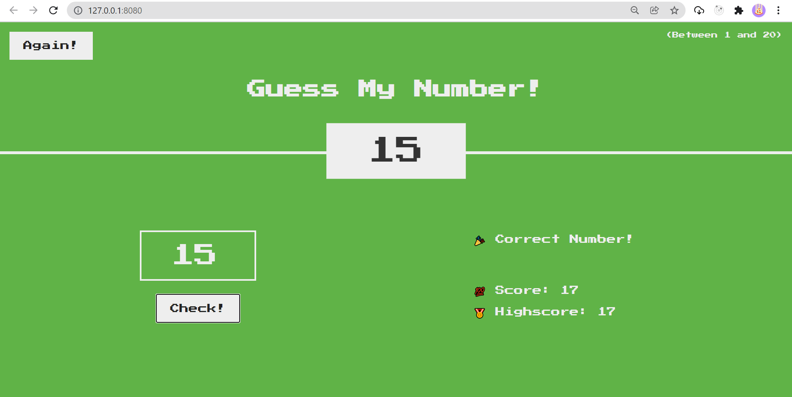

# Guess My Number

> make our time with friends fun

---

### Table of Contents

You're sections headers will be used to reference location of destination.

- [Description](#description)
- [References](#references)
- [Author Info](#author-info)

---

## Description

Guess number between 1 - 20. Your turn to guess number is over when score 0. If you can guess correctly, your current score becomes your highscore. Increase your highscore now!

#### Technologies

- Javascript
- HTML
- CSS

[Back To The Top](#read-me-template)

---

## References

- [HTML & CSS](https://github.com/jonasschmedtmann/complete-javascript-course)

[Back To The Top](#read-me-template)

---

## Author Info

- Twitter - [@armerayfrndy](https://twitter.com/armerayfrndy)
- LinkedIn - [@armeray](https://www.linkedin.com/in/armer-ray-aa1b2411b/)

[Back To The Top](#read-me-template)
